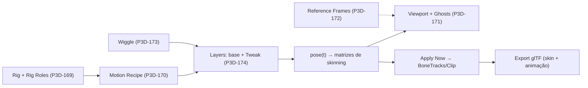

# 45 — Pós-V1: Animate Acessível e Animação Procedural

<aside>
🎬

**Decisão de produto de 2026-09-30.** O workspace Animate deve ser **extremamente fácil para quem nunca animou** e ao mesmo tempo oferecer recursos profundos para quem sabe. O caminho aprovado é **procedural primeiro**: o artista escolhe um *Motion* (andar, correr, respirar, atacar…) e ajusta poucos controles em linguagem comum; a timeline de keyframes, os ghosts e as camadas de ajuste ficam disponíveis por divulgação progressiva. Este capítulo é a autoridade de visão, UX e fasing; o comportamento de cada peça está em [P3D-169](../specs/p3d-169-rig-roles-ik-foundation.md) a [P3D-174](../specs/p3d-174-layered-animation.md).

</aside>

# Papel deste capítulo

Consolida a conversa de 2026-09-30 sobre animação procedural, ghosts de animação e referências em sequência de imagens. Ele:

- registra as **decisões** (abaixo) e o **estado real** do código (Gap Matrix);
- define a **UX em camadas** do Animate;
- reconcilia o roadmap: a animação procedural **não existia** no caderno antes desta data;
- guarda a pesquisa externa como **rationale**, não como requisito (regra do cap. 13: pesquisa não supera decisão normativa).

Autoridade: cap. 34 (ownership e Tool → Command → Algorithm → Data), cap. 36 (UI Baseline), cap. 13 (vocabulário), P3D-160 (Keep Live / Apply Now / Bake). Este capítulo **não reabre** a UI Baseline V1 (`MODEL / PAINT / UV`); Animate é o primeiro workspace **pós-V1** — ver [adendo no cap. 36](36-ui-baseline-temas-plugin-panels.md) e [ADR 006](../../architecture/adr/006-workspace-animate-pos-v1.md).

# Decisões de 2026-09-30

| # | Decisão | Consequência |
| --- | --- | --- |
| D1 | **Procedural primeiro.** A primeira experiência do Animate é escolher e ajustar um Motion, não posar keyframes. | Geradores (P3D-170) e Rig Roles/IK (P3D-169) precedem timeline e ghosts na ordem de entrega. |
| D2 | **Criaturas são cidadãs de primeira classe.** Humanoide, quadrúpede, multi-leg (aranha/escorpião/inseto), serpente, peixe e pássaro têm presets e Motions desde o início. | Os geradores falam em **papéis de osso** e em **número de pernas**, nunca em uma espécie hardcoded (P3D-136: "nenhuma lógica humanoide no core"). |
| D3 | **Sem vídeo e sem ML por enquanto.** Referência de animação é **batch de imagens** (Reference Frames), com UX cuidadosa. | P3D-172 especifica apenas sequência de imagens. Vídeo, estimativa de pose, mocap e geração por IA ficam fora de escopo (ver Não objetivos). |
| D4 | **Documentação autorizada.** O responsável do produto autorizou alterar o caderno para acomodar estas decisões. | Emendas a P3D-066/067/135/136/138/013/160, cap. 08, cap. 13, cap. 36, hub, status e ADR 006. |

# Estado real — Implementation-vs-Spec Gap Matrix (2026-09-30)

Auditoria estática do código em `main` (`e806225`); nada foi compilado para esta tabela.

| ID | Área / contrato | Estado | Evidência |
| --- | --- | :---: | --- |
| AN-01 | Skeleton & Rig Core (P3D-135) | `COMPLIANT` (domínio) | `crates/project/src/rig.rs`: hierarquia sem ciclos, bind pose, pesos normalizados (4 influências), Linear Blend Skinning |
| AN-02 | Clipes e keyframes (P3D-067) | `COMPLIANT` (domínio) | `animation.rs`: trilhas por osso, lerp/slerp, `sample_pose`, `sample_skinning_matrices`, loop e FPS |
| AN-03 | Rig Presets (P3D-136) | `PARTIALLY_COMPLIANT` → `COMPLIANT` (F1.1, 2026-09-30) | `RigPreset::{humanoid, quadruped, multi_leg, serpent, fish, bird}`; todos com papéis inferidos (`Spine_n`, `Tail_n`, `Wing_n.L/R`, pernas) e testados |
| AN-04 | Auto-Rig (P3D-137) | `RUDIMENTARY` (parcialmente melhorado na F2b) | `auto_fit_humanoid` por bounding box e `compute_auto_skin_weights` por distância (só humanoide). **Novo:** o Fit to model (AN-21) serve todos os presets, com pesos mais rígidos para low-poly. Continua sem landmarks e sem correção guiada |
| AN-05 | Retargeting (P3D-138) | `PARTIALLY_COMPLIANT` | `RetargetProfile::mixamo_standard`; sem importação de clipes externos |
| AN-06 | Animation Asset Library (P3D-139) | `RUDIMENTARY` | `AnimationLibrary` tem 2 clipes canônicos; o "walk" anima apenas 2 ossos com 3 keys (é uma demo) |
| AN-07 | Animation Workspace (P3D-066) | `MISSING` no produto → `PARTIALLY_COMPLIANT` (F2, 2026-09-30) | Antes: UI só no egui legado atrás da feature `animation-workspace`. Agora o Slint tem o workspace **Animate** (camadas 1–2): pill ANIMATE (só com a feature), Inspector `Creature → Motions → Motion → Style`, bandeja com um botão por Motion, transporte in-canvas (play/pause, scrub, **Apply Now**/**Bake a copy**) e esqueleto posado projetado no viewport. Pendentes: aceite visual e "teste do iniciante" (não há captura de tela), timeline com keys (F3) e atalhos do Animate. A malha deformada e o **Fit to model** entraram na F2b (AN-19, AN-21) |
| AN-08 | IK e constraints | `MISSING` → `PARTIALLY_COMPLIANT` (F0.5, 2026-09-30) | `petunia_project::ik`: `solve_two_bone` (analítico, pole, soft IK), `solve_fabrik`, look-at e `solve_chain` sobre a pose (só rotações locais dos ossos da cadeia; preserva comprimentos e torção); `IkChain` como dado em `Project::ik_chains` (append-only, validado e podado). Determinístico e testado (alcance, clamps, pole, continuidade do soft IK, pesos). Pendente: comandos (F0.6), limites angulares no FABRIK, foot planting por fase de contato (F1) |
| AN-09 | Animação procedural | `MISSING` → `PARTIALLY_COMPLIANT` (F1, 2026-09-30) | `petunia_project::{motion, motion_gen}`: `MotionRecipe` (dado serializável em `Project::motions`), `pose(t)` puro e determinístico, geradores **BipedCycle** (walk/run, pés plantados por IK, braços contralaterais), **Gait** de N pernas (alternado, sequência lateral, onda; tetrapod para aranhas; ondulação de coluna e cauda), **Serpentine** (serpente, peixe, cauda) e **IdleBreath**; controles universais, Styles, Stepped, In Place/Root Motion; **Apply Now** com redução de chaves; export glTF sempre baked. Pendentes: Wing Flap, Reaction (Hit/Die), Action (Attack/Eat/Wave/Jump), Look/Aim, Wiggle (P3D-173) e UI |
| AN-10 | Secondary motion (spring/wiggle) | `MISSING` | — |
| AN-11 | Ghosts e trajetórias | `MISSING` | — |
| AN-12 | Referência em sequência de imagens | `MISSING` | `ReferenceImage` (P3D-013) é estática e sem tempo |
| AN-13 | glTF com skin e animação | `MISSING` → `PARTIALLY_COMPLIANT` (F0.2/F0.3, 2026-09-30) | Export (`gltf_rig.rs`): joints com TRS de repouso, `skin` + `inverseBindMatrices`, `JOINTS_0`/`WEIGHTS_0`, `animations` (translation/rotation/scale, LINEAR/STEP) e `extras.petunia` (bone_id, tail, fps, loop). Import (`import_rig`): skeleton a partir da IBM, rotações de repouso, pesos (u8/u16), clipes (CUBICSPLINE convertido, com aviso) e `Project::add_imported_rig`. Round-trip e GLB externo testados. Pendente: UV/normais no import de malha (`import_glb_bytes` lê só posições), skins com mais de 4 influências, escala de bind ≠ 1, ancestral com transformação (avisos honestos) e UI de importação |
| AN-14 | Undo/transações de rig e clipes | não auditado → `PARTIALLY_COMPLIANT` (F0.6, 2026-09-30) | `petunia_core::rig_commands`: `AddRigPresetCmd`, `AutoRigActiveAssetCmd`, `RemoveSkeletonCmd`, `AssignRigRoleCmd`, `ClearRigRoleCmd`, `InferRigRolesCmd`, `AddIkChainCmd`, `UpdateIkChainCmd`, `RemoveIkChainCmd`, `AddAnimationCmd`, `RemoveAnimationCmd`, `SetBoneKeyCmd`, `DeleteBoneKeyCmd` — todos via dispatcher (checkpoint e rollback do owner), `NoChange` sem histórico, `do → undo → redo` por hash e sem tocar revisões de render. Ainda **não registrados em `canonical()`** (palette/keymap/MCP): dependem da decisão D-21 do catálogo de comandos parametrizados. Edição de ossos (mover/criar) continua fora de comando (egui legado) |

| AN-15 | Morph Targets (P3D-162) | `MISSING` | — |
| AN-16 | Bind pose e repouso do Rig Core | `BROKEN` → `COMPLIANT` (F0, 2026-09-30) | Achado ao preparar o glTF: `head` é absoluto, mas o bind compunha `pai × translate(head)` (acumulava a hierarquia) e `local_transform` nascia identidade; um osso fora da origem não voltava à identidade em repouso e trilhas só de rotação soltavam o osso do pai. Corrigido: bind = `translate(head)`, offset local de repouso = `head − head_do_pai`, canais sem keyframes herdam o repouso (`sample_transform_over`); testes de repouso/reparent/remoção |
| AN-17 | Pesos de skin: ID de osso × índice | `PARTIALLY_COMPLIANT` (aberto) | O Auto-Skin grava **IDs** de osso em `VertexSkinWeight.bones`, mas `SkinData::deform_vertex`/`validate` os tratam como **índice** em `Skeleton.bones`; coincidem enquanto os IDs são densos (nenhuma remoção de osso). O export glTF e o preview de pose (`posing::skin_mesh`) resolvem ID → índice; só `SkinData::deform_vertex`/`validate` (legado) seguem tratando ID como índice. Correção do consumidor exige política de `remove_bone` com pesos |
| AN-18 | Rig Roles (P3D-169, dados) | `MISSING` → `COMPLIANT` no domínio (F0.4, 2026-09-30) | `RigRole`/`RigRoleMap` em `petunia_project::rig_roles`; atribuição validada (osso existente, papel único, erro que nomeia o dono), pernas completas (coxa + canela, pé opcional), cadeias de coluna/cauda, `RigRequirement` com erros legíveis, inferência por nomes (presets Petunia, Mixamo, genéricos), armazenado em `Project::rig_roles` (append-only, retrocompatível), poda em `validate()` e round-trip em `extras.petunia.roles` do glTF. Sem comandos/UI ainda (F0.6) |

| AN-19 | Malha deformada no viewport | `MISSING` → `PARTIALLY_COMPLIANT` (F2b, 2026-09-30) | `petunia_project::posing`: `PoseOverride` (malhas deformadas **transitórias**, nunca serializadas nem em Undo), Linear Blend Skinning por **id de osso → índice** e `posed_meshes`; `PetuniaViewport::set_pose_override` faz os dois backends (software e wgpu) desenharem a malha deformada no lugar da malha em repouso, **sem tocar o documento**; o wgpu só reconstrói buffers quando a revisão do override muda e o bridge só avança a revisão quando a geometria muda. Limites conhecidos: assets com modifiers ativos ficam em repouso (os pesos são da malha-base); só LBS (sem correção de volume); normais recalculadas pelas faces; skinning na CPU. **O caminho wgpu não foi exercitado com GPU** (o ambiente de desenvolvimento não tem adaptador): há teste puro da lógica de revisão e um teste de GPU que é pulado sem adaptador; o backend de software tem teste de pixels. Sem avaliação visual |
| AN-20 | Compilação do Slint com `animation-workspace` | `BROKEN` → `COMPLIANT` (F2, 2026-09-30) | Com a feature ligada, `petunia_ui_slint` **não compilava** (`match` de `Workspace` não exaustivo nos atalhos Ctrl+PgUp/PgDn). Corrigido; o ciclo de workspaces inclui ANIMATE só com a feature e a feature da raiz agora liga também o lado Slint |
| AN-21 | Ligar um modelo a uma criatura (Fit to model) | `MISSING` → `PARTIALLY_COMPLIANT` (F2b, 2026-09-30) | `FitRigToActiveAssetCmd` leva **qualquer preset** ao volume do modelo ativo (mapeia os limites do rig para os do modelo; gira 90° em Y quando o eixo longo difere; frente × costas não é inferível) e liga a malha por pesos que seguem o osso mais próximo e só misturam perto das articulações (`compute_blended_skin_weights`). Um passo de Undo; repetir não cria histórico. Ainda sem pintura de pesos, sem inversão frente/costas e sem correção guiada |

Leitura: **o domínio de rig e clipes é sólido; o produto não o alcança**. O maior risco para "game-ready" é AN-13: sem skin/animação no glTF, nenhuma animação sai do Petunia.

# Princípios

1. **Simple first, advanced available.** Quem só quer "andar" nunca vê a timeline. Quem quer controle a encontra sem mudar de ferramenta.
2. **Linguagem do artista, não do animador.** Sliders chamam-se Speed, Energy, Weight, Stride — não `phase_offset` ou `duty_factor` (estes aparecem só em Advanced).
3. **Determinismo.** `pose(t)` é uma função pura de `(rig, receita, seed, t)`: mesmo resultado sempre, testável por hash.
4. **Keep Live, Apply Now.** O Motion permanece vivo e parametrizado até o usuário decidir convertê-lo em keys editáveis (P3D-160). Nada é convertido em silêncio.
5. **Nunca esconder limitações.** Rig sem os papéis exigidos produz erro estruturado e legível ("este Motion precisa de 2 ou mais pernas com coxa, canela e pé"), nunca uma animação quebrada.
6. **Low-poly por natureza.** Estilos como **Stepped** (12–15 fps, estética PS1/N64) são cidadãos de primeira classe, não hacks.
7. **Sem conteúdo de level.** Animação de asset, não de cena (P3D-128).

# UX em quatro camadas

| Camada | Público | O que oferece |
| --- | --- | --- |
| **1. Escolher** | Zero conhecimento | Auto-Rig (ou escolher o tipo de rig) → escolher um **Motion** de uma grade com prévia ao vivo → poucos sliders (**Speed, Energy, Weight, Stride, Lean**) e **Styles** (Cartoon, Heavy, Stiff, Floaty, Stepped). Exportar. |
| **2. Personalizar** | Iniciante | Parâmetros específicos do Motion, **Wiggle** em cauda/cabelo/capa, pés plantados, **Make Loop**, **In Place** versus **Root Motion**. |
| **3. Posar** | Intermediário | Timeline com keys, **Ghosts**, **Motion Trails**, biblioteca de poses, espelhar pose, **Reference Frames**. |
| **4. Refinar** | Avançado | **Tweak Layers** (ajustes aditivos sobre o Motion), presets de easing, Apply Now para converter em keys. **Sem graph editor** (P3D-066). |

Regra de divulgação: a camada 1 é o estado inicial do workspace. As camadas seguintes aparecem por seções do Inspector (independentes, com dock/float/pin conforme [ADR 005](../../architecture/adr/005-modulos-inspector-dock-float-pin.md)) e nunca são pré-requisito para exportar.

## Teste do iniciante (critério de aceite de UX)

Uma pessoa sem experiência em animação deve conseguir, sem ler documentação, levar um modelo low-poly de **Auto-Rig** a um **glTF exportado andando** em cinco passos: (1) selecionar o modelo, (2) confirmar o tipo de rig, (3) adicionar o Motion *Walk*, (4) ajustar *Energy*/*Speed* olhando a prévia, (5) exportar. O tempo e a taxa de sucesso devem ser **medidos em teste com artistas** antes de qualquer alegação de acessibilidade (regra do cap. 36: nenhuma alegação sem evidência).

# Modelo conceitual

- **Rig Roles** dão semântica aos ossos (`Hips`, `Leg.Thigh`, `Leg.Foot`, `Tail`…). Geradores e retarget consomem **papéis**, não nomes.
- **Motion Recipe** é dado serializável (gerador, parâmetros, seed, papéis, revisão). É avaliado como `pose(t)` puro.
- **Layers** combinam a base (Motion ou clipe) com ajustes aditivos e Wiggle.
- **Ghosts e Trails** são overlays de leitura: consomem `pose(t)` e nunca mutam o documento.
- Cadeia funcional obrigatória: `Tool → Command → Algorithm → Data`. O módulo de animação não conhece UI; o renderer recebe descritores neutros.

# Motions iniciais (criaturas de primeira classe)

| Rig | Motions |
| --- | --- |
| Humanoide | Walk, Run, Idle (respirar), Wave, Jump, Attack, Hurt, Die |
| Quadrúpede | Walk, Trot, Run, Idle, Attack, Eat, Hurt, Die |
| Multi-leg (aranha, escorpião, inseto) | Walk, Run, Idle, Attack, Die — **mesmo gerador de gait**, parametrizado por nº de pernas |
| Serpente | Slither, Idle, Strike, Die |
| Peixe | Swim, Idle, Die |
| Pássaro | Walk, Flap, Glide, Idle, Die |

Os nomes acima são o **catálogo alvo**, não uma promessa de V1 do Animate. O contrato técnico dos geradores está em [P3D-170](../specs/p3d-170-procedural-motion-generators.md); a economia vem de poucos geradores parametrizados (ciclo bípede, gait de N pernas, onda serpentina, batida de asa, respiração, reação) e não de uma animação codificada por espécie.

# Ghosts e trajetórias

Ghost é uma silhueta translúcida da pose em frames vizinhos (passado e futuro); Motion Trail é o caminho de um osso ao longo de um intervalo. Como o Petunia trabalha com malhas low-poly e `pose(t)` é barato, desenhar N ghosts é viável. Detalhes de modos, orçamento e acessibilidade (nunca depender só de cor) em [P3D-171](../specs/p3d-171-animation-ghosts-trajectories.md).

# Reference Frames — batch de imagens

O usuário arrasta uma pasta de imagens (ou várias imagens); o Petunia ordena naturalmente (`frame2` antes de `frame10`), mostra uma **filmstrip** sincronizada à timeline, permite marcar quais frames são **key poses** e exibe o frame corrente como camada de referência (opacidade, hold-to-compare, monitor flutuante in-canvas). Nenhum decodificador de vídeo é necessário: para vídeo, a documentação orienta extrair frames externamente. Especificação completa e UX em [P3D-172](../specs/p3d-172-reference-image-sequence.md).

# Exportação game-ready

Animação só é entregável se sair do Petunia. Portanto a fase inicial inclui **glTF com skin e animação** (export e import, com round-trip testado — P3D-124). Nomes de clipe, taxa de quadros, orçamento de ossos/influências e validação entram no Asset Validator (P3D-144) quando existir.

# Análise do Dust3D (rationale)

[Dust3D](https://github.com/huxingyi/dust3d) (MIT, C++17/Qt) é a referência aberta mais próxima do que queremos e tem a mesma licença do Petunia. **Escopo desta análise:** README, site, notas da release 1.0.0 e o arquivo `dust3d/animation/biped/hurt.cc`; não foi lido o repositório inteiro.

**O que faz.** Rotula-se arestas com nomes de osso e o programa infere esqueleto e pesos. Há sete rig templates — biped, quadruped, bird, fish, snake, insect e spider — cada um com animações procedurais (por exemplo biped: walk, run, jump, idle, roar, hurt, die; spider: walk, run, idle, die). A release 1.0.0 trocou IK iterativo por **IK analítico de dois ossos + soft IK**, adicionou **UI de parâmetros dirigida por dados**, ragdoll para "die", sons procedurais de passo e preview com scrub e visualização de pesos. Exporta GLB e FBX.

**Como uma animação é feita.** Em `hurt.cc` não há keyframes: o tempo normalizado vira quatro fases sobrepostas (hit-freeze, impacto, cambaleio, recuperação) por `smoothstep` e exponenciais; parâmetros têm nomes legíveis (`recoilIntensity`, `staggerAmplitude`, `bodyMassFactor`, `hitDirection`); os pés ficam plantados por IK de dois ossos com pole vector; a saída são matrizes de skinning por frame. A animação exige uma lista fixa de nomes de osso.

| Adotar | Não adotar |
| --- | --- |
| Animação como função pura `pose(t, parâmetros)` | Uma animação em C++ por espécie (explosão N rigs × M animações) |
| Parâmetros com nome humano que viram sliders | Contrato por **nome** de osso (usamos **papéis**, P3D-169) |
| IK analítico com pés plantados | IK iterativo como solver padrão para articulações de 2 ossos |
| Rig validado antes de animar, com erro claro | Ragdoll como comportamento padrão (opcional, P3D-173) |
| Preview ao vivo com scrub | Exportação FBX (formato proprietário; glTF é o formato do Petunia) |

Portar código exige preservar o aviso MIT do Dust3D; a adoção prevista aqui é de **ideias e estruturas**, reescritas sobre o Rig Core do Petunia.

# Pesquisa externa (rationale, não requisito)

| Família | Referência | Leitura para o Petunia |
| --- | --- | --- |
| Pose-to-pose com ghosts e trajetórias | [Cascadeur — Ghosts](https://cascadeur.com/help/tools/animation_tools/ghosts); [Blender — Onion Skinning](https://docs.blender.org/manual/en/latest/grease_pencil/properties/onion_skinning.html) e [Motion Paths](https://docs.blender.org/manual/en/2.80/animation/motion_paths.html) | Modelo de modos (anteriores, seguintes, ambos, selecionados, só keys) e de Motion Paths com `Step` → P3D-171 |
| IK | [FABRIK (Aristidou & Lasenby, 2011)](https://www.andreasaristidou.com/publications/papers/FABRIK.pdf); IK analítico de dois ossos; soft IK | Analítico para pernas/braços; FABRIK para cadeias longas (cauda, tentáculo, serpente) → P3D-169 |
| Locomoção procedural | [runevision — criaturas procedurais](https://blog.runevision.com/2025/01/procedural-creature-progress-2021-2024.html); Rain World; Overgrowth | Posicionamento de pés por alvo/raycast e padrões de passo alternados (tetrapod) → P3D-170 |
| Motores de jogo | [Unity Animation Rigging](https://unity.com/resources/procedural-poses-motion-animation-rigging); Unreal Control Rig; Godot `SkeletonModifier3D` | Confirmam IK e secondary motion como camada procedural padrão da indústria |
| Secondary motion | [Godot `SpringBoneSimulator3D`](https://docs.godotengine.org/en/stable/classes/class_springbonesimulator3d.html); VRM SpringBone | Cadeias com rigidez/amortecimento → P3D-173 |
| Física | [DeepMimic (Peng et al., 2018)](https://www.cs.ubc.ca/~van/papers/2018-TOG-deepMimic/index.html) | Pesquisa (aprendizado por reforço); **fora de escopo**. Ragdoll simples basta |
| Data-driven | [Learned Motion Matching (Holden et al., 2020)](https://dl.acm.org/doi/10.1145/3386569.3392440) | Exige grande banco de mocap; **fora de escopo** |
| Generativo | [MDM (Tevet et al., 2022)](https://arxiv.org/abs/2209.14916); [T2M-GPT](https://mael-zys.github.io/T2M-GPT/); [MotionGPT](https://arxiv.org/pdf/2306.14795) | Texto → movimento de **humanos**; não atende criaturas; **fora de escopo** (D3) |
| Vídeo → movimento | [BlazePose GHUM](https://arxiv.org/pdf/2206.11678); Rokoko Vision, DeepMotion, Plask, Move.ai | Ruidoso e restrito a humanos; **fora de escopo** (D3). P3D-129 também veda nuvem obrigatória |
| Retarget e auto-rig | [Aberman et al., 2020](https://arxiv.org/pdf/2005.05732); [Pinocchio (Baran & Popović, 2007)](https://dl.acm.org/doi/10.1145/1276377.1276467); [UniRig](https://github.com/VAST-AI-Research/UniRig) | Retarget semântico por papéis basta; auto-rig por ML fica como possibilidade futura |

# Fases de entrega

A ordem respeita a regra de reconciliação (AGENTS §2): preservar o `COMPLIANT`, corrigir o delta comprovado, sem big-bang.

| Fase | Entrega | Depende de | Critério de saída |
| --- | --- | --- | --- |
| **F0** Fundação headless | Rig Roles + IK (P3D-169); glTF com skin e animação (AN-13); comandos de rig/clipe registrados no dispatcher canônico e transacionais | D-02 (dono único de transação) | Round-trip glTF testado; comandos com Undo/Redo por hash |
| **F1** Motions headless | Geradores e Style (P3D-170); presets de serpente, peixe e pássaro (P3D-136) | F0 | Determinismo por hash, fechamento de loop, pés plantados dentro de tolerância |
| **F2** Shell Animate (camadas 1–2) | Workspace Animate no Slint com Motion picker, Style, Speed/Energy/…, playback e export | F1, [ADR 006](../../architecture/adr/006-workspace-animate-pos-v1.md), componentes focáveis (AX-03) | Teste do iniciante medido; navegação por teclado. **Estado 2026-09-30: implementado e testado sem captura de tela; aceite visual, teste do iniciante e malha deformada pendentes (ver "Estado da fase F2")** |
| **F3** Posar (camada 3) | Timeline com keys, Ghosts e Trails (P3D-171), biblioteca de poses, Apply Now | F2 | Ghosts dentro do orçamento em modelo denso |
| **F4** Referência e camadas | Reference Frames (P3D-172), Tweak Layers e blend de Motions (P3D-174) | F3 | Batch de 500 imagens sem travar a UI |
| **F5** Wiggle e biblioteca | Secondary motion e ragdoll simples (P3D-173); Animation Asset Library com UX (P3D-139) | F4 | Wiggle determinístico e scrubável |

Cada fase encerra com os gates do AGENTS §4 e um registro de evidência; nenhuma fase é dada como concluída por presença de botão ou callback.

# Estado da fase F1 (2026-09-30)

A fase F1 está implementada **no domínio e nos comandos**, sem UI:

- Geradores entregues: `BipedCycle`, `Gait` (N pernas), `Serpentine`, `IdleBreath`. Ainda não existem `Wing Flap`, `Reaction` (Hit/Die), `Action` (Attack/Eat/Wave/Jump) e `Look/Aim` — o catálogo "alvo" do capítulo continua sendo alvo.
- Comandos: `AddMotionCmd`, `SetMotionParamCmd`, `SetMotionStyleCmd`, `UpdateMotionCmd`, `DuplicateMotionCmd`, `RemoveMotionCmd` e `ApplyMotionNowCmd` (`Keep Live` ou converter), todos transacionais. O "teste do iniciante" existe como teste de comandos (Auto-Rig → Motion → glTF), **sem** a medição com artistas que o capítulo exige.
- Convenção de eixos: frente e lateral são derivadas do rig (Hips→Head, direção dos pés, eixo da raiz), sem convenção nova; o cap. 10 segue "a congelar".
- Limitações conhecidas: a avaliação clona cadeias de IK por frame (sem orçamento de desempenho medido); pesos/parâmetros padrão são a recomendação inicial e **não passaram por avaliação visual**; nenhum gerador trata terreno (P3D-128).

# Estado da fase F2 (2026-09-30)

A fase F2 está implementada em **Slint**, atrás da feature `animation-workspace` (a pill só existe com ela, conforme o [ADR 006](../../architecture/adr/006-workspace-animate-pos-v1.md)), **sem captura de tela nem aceite visual**:

- **Domínio neutro (`petunia_core::animate_session`)**: `AnimateSession` (criatura, Motion, playhead, play, draft de slider), `AnimatePreview` (avaliador em cache **por conteúdo** — Undo volta a revisões já vistas — e amostragem da pose), `motion_catalog` (o que cada rig suporta, com o motivo como enum, sem texto) e as ações `animate_*` em `AppState`, todas via comandos transacionais.
- **Um clique e já se move**: escolher um Motion cria, seleciona e toca. Motions que o rig não suporta **aparecem desabilitados com o motivo** em linguagem simples ("Precisa de pelo menos duas pernas"), nunca somem.
- **Slider sem inundar o histórico**: arrastar emite *draft* (preview ao vivo, projeto intocado) e soltar confirma **um** passo de Undo; no teclado cada passo confirma na hora. O slider é próprio (`AnimSlider`) justamente para separar `previewed` de `committed`.
- **Bridge Slint (`crates/ui-slint/src/animate.rs`)**: o markup emite só `(ação, argumento, valor)`; `AnimateIntent::parse` traduz. Listas e sliders são atualizados **no lugar** (`VecModel::set_row_data`) para não recriar controles e perder foco/arrasto. Toda string visível vem de `TextId` ou de chaves `animate.<grupo>.<id>` cobertas por teste em en e pt-BR.
- **Layout (subordinado ao cap. 36, sem docking novo)**: Inspector à direita **aberto por padrão no Animate** (é a superfície principal) com `Creature → Motions → Motion → Style`; bandeja à esquerda com um botão por Motion; **transporte in-canvas** (play/pause, scrub, *Bake a copy* = Keep Live, *Apply Now* = converter) no lugar da timeline, que só chega no F3.
- **Viewport**: o esqueleto posado (ossos + articulações) é projetado pelo bridge para pixels e desenhado como `Path` Slint — **independente do backend** (wgpu ou software), mesmo padrão do gizmo.
- **Malha deformada (F2b)**: com um modelo ligado à criatura (botão **Fit to model**, em destaque enquanto nada está ligado), o viewport desenha a malha deformada pela pose — no scrub, no play e até enquanto um slider é arrastado (draft). O documento continua guardando a malha em repouso (`PoseOverride` transitório). Sair do Animate volta ao repouso.

**Não feito nesta fase (honestidade):** o caminho **wgpu** da malha deformada nunca rodou com GPU (só lógica de revisão e compilação); assets com modifiers ficam em repouso; atalhos de teclado do Animate (Space/setas); aceite visual e "teste do iniciante" medido; timeline com keys, Ghosts e Trails (F3); os geradores ainda pendentes do F1. A suíte `crates/ui-slint/tests/animate_shell.rs` exercita cliques, arrasto, teclado e acessibilidade reais no shell, mas **não substitui** olhar o resultado.

# Não objetivos

- Ferramentas de vídeo: decodificação, tracking, estimativa de pose, mocap (D3).
- Geração de movimento por IA (texto → movimento) e motion matching.
- Aprendizado por reforço, física de corpo rígido geral, cloth, fluidos, groom.
- Graph editor, NLA, state machines de gameplay e blend trees complexas (isso é papel da game engine).
- Facial animation completa e lip-sync (morphs simples seguem em P3D-162).
- Competir com suítes profissionais de animação (seção G).

# Riscos e mitigação

| Risco | Mitigação |
| --- | --- |
| Motions genéricos parecerem "robóticos" | Styles, Energy/Weight, ruído determinístico por seed, Tweak Layers |
| Simulação (Wiggle, ragdoll) quebrar scrubbing | Simulação com cache determinístico a partir de checkpoints; Apply Now como caminho garantido (P3D-173) |
| Explosão de combinações N rigs × M Motions | Geradores parametrizados por papéis e nº de pernas (D2) |
| Workspace inflar o shell V1 | Animate é pós-V1, só aparece implementado, sem docking irrestrito (ADR 006) |
| Alegar acessibilidade sem prova | Teste do iniciante com artistas antes de qualquer alegação |
