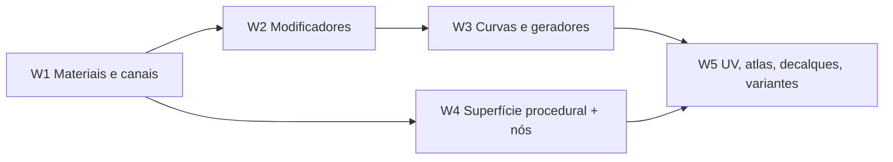

# Pacote de implementação — modelagem e superfície em 5 waves (05/10/2026)

Decisão do responsável do produto (05/10/2026): **antes do Animate**, implementar
tudo que falta no escopo de modelagem DRAW/POLY, UV, Paint, efeitos, decalques,
texturas e o **node system** de textura e geração procedural. A implementação é
feita **uma wave por vez**; a bateria completa de testes e o aceite acontecem ao
fim de cada wave, antes de abrir a seguinte.

Este documento é plano operacional. A autoridade continua no caderno
(`docs/bible/`): cada item aponta a spec ou o capítulo de origem. Em conflito, o
caderno vence e o conflito é sinalizado.

## Regras do pacote

1. **Uma wave por vez.** A wave seguinte só começa depois do aceite da anterior.
2. **Passo 0 de cada wave — SPEC READY.** Antes do código, reconciliar as specs da
   wave (const. 08, "Regra para implementação por agentes"): objetivo, não
   objetivos, modelo de dados, dependências, Commands/API, UX de viewport e
   Inspector, feedback visual, Undo, persistência, invalidação e testes. A matriz
   implementação × spec da wave é registrada em `docs/development/`.
3. **Testes unitários acompanham cada item** (Definition of Done do AGENTS §4). O que
   fica para o fim da wave é a **bateria completa** e o aceite.
4. **Gate de saída de cada wave:**
   - `cargo fmt --check`, `cargo check`, `cargo clippy -D warnings` dos crates tocados;
   - suítes completas dos crates tocados;
   - `xtask docs-generate`, `docs-check`, `bible-check`, `ui-lint`, `ui-guard --strict`;
   - testes de cenário da wave (listados abaixo);
   - roteiro manual com captura nativa (`docs/development/wave-N-manual.md`);
   - CHANGELOG, matrizes e estado do projeto atualizados; um PR por wave.
5. **Filosofia em toda decisão:** shape-first, gramática única de ferramenta,
   `Tool → Command → Algorithm → Data`, `Apply / Keep Live / Bake`, recursos locais
   ao asset, PC modesto, textos por `TextId`, nada de nós como fluxo obrigatório.

Escalas: **Trab.** 1–10 (escala do caderno; * = estimativa);
**Tam.** P = um módulo, M = dados + interface, G = subsistema, GG = vários.

## Visão geral

| Wave | Tema | Por que nesta posição | Itens | Tamanho |
| --- | --- | --- | --- | --- |
| **1** | Fundação de materiais e canais, ganhos rápidos e dívidas | canais são pré-requisito de receitas, decalques por canal e bake; dívidas não podem acumular | 10 | G |
| **2** | Modelagem não destrutiva | a pilha de modificadores é base de deformadores, Conform e "repetir no caminho" | 9 | G |
| **3** | Curvas, caminhos e geradores | usa a pilha da W2; prepara os operadores que os nós de geração da W5 compõem | 10 | G |
| **4** | Superfície procedural e **node system** | precisa dos canais (W1); o bake de mapas alimenta os nós de desgaste e sujeira | 11 | GG |
| **5** | UV, atlas, decalques avançados e variantes | fecha o ciclo da superfície; reaproveita o editor de nós da W4 para geração | 9 | G |

## Wave 1 — Fundação de materiais e canais

**Objetivo:** ligar ponta a ponta o modelo de material que **já existe**. Hoje
`Material` tem seis canais com textura (albedo, normal, rugosidade, metálico,
emissão, altura), mas o renderer só lê o albedo, a exportação glTF só escreve o
albedo e a pintura ignora o campo `paint_channel`.

| # | Item | Origem | Estado (05/10) | Trab. | Tam. |
| --- | --- | --- | --- | --- | --- |
| W1.1 | Auditoria e reconciliação do sistema de materiais; Inspector de material com canais e escalares | P3D-050 | rudimentar | 4* | M |
| W1.2 | Canais no renderer (wgpu, GL e software): normal map com tangentes, mapas de rugosidade e metálico no PBR, emissão; altura como bump na prévia | P3D-051–054 | só albedo | 6* | G |
| W1.3 | **Pintar canais**: o pincel escreve no canal ativo (escala de cinza nos canais escalares); ver um canal isolado no canvas 2D e na viewport | P3D-062 | campo de estado sem uso | 5* | M |
| W1.4 | Exportação dos canais: `metallicRoughness` empacotado, `normalTexture`, `emissiveTexture`; mapas no `.mtl` do OBJ; auditoria do pipeline de exportação | P3D-068 | só albedo | 4* | M |
| W1.5 | Perfis de shader completos (Toon e Glass) e prévia de dithering e perfis retrô | P3D-140, const. 08 | Unlit e Emissive parciais | 4* | M |
| W1.6 | Presets de material | const. 08 | ausente | 3* | P |
| W1.7 | Presets de pivô e origem; fluxo de dobradiça | cap. 43 | ausente | 2–3 | P |
| W1.8 | Dimensões, guias de escala de jogo e validação de caixa envolvente | const. 08, cap. 43 | parcial | 2* | P |
| W1.9 | Dívidas de interação: textos antigos do HUD por `TextId`; redesenho coalescido por quadro; confirmar Loop Cut/Slice/Knife/Profile na `ToolSession` com buffer único | AGENTS §3, ADR 007 | parcial | 4* | M |
| W1.10 | Pendências de validação do DRAW/POLY: inset métrico, plano por 3 pontos, imprint em várias faces com furos, Knife entre faces | matrizes DRAW/POLY | parcial | 3* | P |

**Cenários de teste da wave:** pintar rugosidade e ver o brilho mudar na viewport;
exportar GLB e ler os mapas de volta (`gltf`); round-trip do projeto com canais;
perfis Toon e Glass em wgpu e software; pivô por preset com Undo; nenhum texto
visível fixo no HUD (teste de cobertura de `TextId`).

**Decisão necessária antes do código (D1):** como camadas e canais se relacionam.
Recomendação: **cada camada tem canais-alvo**. A camada raster pinta o canal ativo;
camadas de receita e de decalque podem escrever vários canais de uma vez. A
alternativa, uma pilha de camadas por canal, é mais simples, mas obriga uma receita
"metal enferrujado" a virar várias camadas soltas.

## Wave 2 — Modelagem não destrutiva

**Objetivo:** a pilha de modificadores completa, com deformadores visuais e a
hierarquia de partes. Hoje só existem Mirror e Symmetry.

| # | Item | Origem | Estado | Trab. | Tam. |
| --- | --- | --- | --- | --- | --- |
| W2.1 | Pilha de modificadores geral: ordem, ligar/desligar, cache da malha avaliada (ADR 008), `Apply / Keep Live / Bake`, aviso de invalidação de UV, decalque e morph | P3D-157, P3D-160, cap. 43 | Mirror e Symmetry | 5–6 | G |
| W2.2 | Array linear e radial | cap. 41 | ausente | 3–4 | M |
| W2.3 | Espessura para malhas | cap. 41 | ausente | 4–5 | M |
| W2.4 | Bend, Taper, Twist e Stretch com **caixa de deformação** e alças na gramática única | cap. 41, const. 08 | ausente | 3–4 cada | M–G |
| W2.5 | Decimate simples | cap. 41 | ausente | 6 | M |
| W2.6 | Surface Conform | cap. 41 | ausente | 5 | M |
| W2.7 | Manipulador de superfície compartilhado (extraído da ferramenta de decalque): deslizar por raio, girar na normal, escalar, espelhar | const. 08 | só no decalque | 4* | M |
| W2.8 | Hierarquia de partes e instâncias vinculadas | P3D-166 | ausente | 4 | M |
| W2.9 | Simetria rápida e presets de primitivas | const. 08 | parcial | 2–3* | P |

**Cenários de teste:** pilha com 4 modificadores avaliada em menos de um quadro na
cena de referência (benchmark); `Apply` e `Keep Live` com Undo; aviso ao aplicar
modificador sobre um asset com decalque; instância vinculada que acompanha o
original; caixa de deformação com valor digitado e Esc.

## Wave 3 — Curvas, caminhos e geradores

**Objetivo:** completar o desenho de formas (offset, corte, loft, extrusões) e os
geradores de caminho. Hoje o único gerador é o Sweep.

| # | Item | Origem | Estado | Trab. | Tam. |
| --- | --- | --- | --- | --- | --- |
| W3.1 | Offset de curva e região (cantos redondos ou retos) | pesquisa 01/10 (D9) | ausente | 5* | M |
| W3.2 | Cortar e dividir em interseções | D10 | parcial (sem ferramenta) | 4* | M |
| W3.3 | Loft entre perfis | D12 | ausente | 5* | M |
| W3.4 | Extrusão com conicidade, torção, simétrica e com chanfro no topo | D11 | ausente | 4* | M |
| W3.5 | Curvas Bézier preservadas no Shape Builder | pesquisa 01/10 | ausente | 6* | G |
| W3.6 | Formas paramétricas e conversão explícita DRAW → POLY | matriz de regiões | ausente | 5* | G |
| W3.7 | Operadores de caminho: repetir e esticar ao longo do caminho; regras de ponta e canto | cap. 40 | ausente | 4* | M |
| W3.8 | Geradores: cerca, parede, corrimão, corrente, moldura, trilho, guard-rail | cap. 40, P3D-168 | só Sweep | 4–6 cada | G |
| W3.9 | Modificadores "repetir no caminho" e "curvar no caminho" | cap. 41 | ausente | 4–6 | M |
| W3.10 | Cabelo low-poly (curvas-guia → mechas geométricas) | P3D-163 | ausente | 6* | G |

**Cenários de teste:** offset e loft com valor digitado e Undo; Shape Builder sem
perder Bézier; cerca gerada a partir de um caminho, editada e assada; cabelo com
contagem de triângulos dentro do orçamento declarado.

## Wave 4 — Superfície procedural e node system

**Objetivo:** efeitos procedurais e o **node system** de textura, "extremamente fácil"
conforme o cap. 42: o usuário comum só vê presets; o grafo existe para compor
operações simples e fica em *Advanced*. Hoje o grafo de receitas existe só no
domínio (`surface_recipe.rs`, 8 tipos de nó, avaliador com cache, ciclos
rejeitados), **sem interface**.

| # | Item | Origem | Estado | Trab. | Tam. |
| --- | --- | --- | --- | --- | --- |
| W4.1 | Bake de mapas geométricos (AO, curvatura, altura, posição, direção da normal) para camada ou canal, no contrato de Bake | P13, P3D-160, const. 08 | ausente | 6* | G |
| W4.2 | **Nós — motor:** Noise, Voronoi, Limiar/Níveis, UV, Cor de vértice, entradas AO/Curvatura, Desgaste de borda, Sujeira, Variação de cor; saídas por canal (cor, rugosidade, normal, altura, máscara) | cap. 42, P3D-164 | 8 nós, só cor | 3–5 cada | G |
| W4.3 | **Nós — camada 1:** "Add Effect" lista receitas prontas (Sujeira, Desgaste, Variação de cor, Ruído de pixel, Gradiente) com 2–4 controles nomeados | cap. 42 | 7 efeitos fixos | 4* | M |
| W4.4 | **Nós — camada 2:** *Edit Recipe* como **cadeia vertical** (não tela livre), miniatura ao vivo por nó, conexões por cor **e** forma, expor parâmetro com um clique, sem laços | cap. 42, P3D-113 | ausente | 6* | G |
| W4.5 | Receitas como asset: salvar, arrastar para outro objeto, biblioteca; formato para plugins registrarem receitas | cap. 42 | ausente | 3* | P |
| W4.6 | Máscaras de camada não destrutivas | P3D-132 (P9) | ausente | 5* | M |
| W4.7 | Máscara do pincel por material ou ilha | P8 | parcial | 3* | P |
| W4.8 | Clonar de outra camada ou imagem | P11 | parcial | 3* | P |
| W4.9 | Pintura tileável com prévia do tile | P3 | ausente | 3* | P–M |
| W4.10 | Cor de vértice na interface e AO por vértice | P3D-150, P14 | só domínio | 3* | P |
| W4.11 | Biblioteca de pincéis e presets de ferramenta | P3D-153 | parcial | 3* | P |

**Cenários de teste:** receita avaliada é determinística por hash; "Add Effect →
Desgaste" muda cor e rugosidade ao mesmo tempo; editar a receita e ver a miniatura
de cada nó; receita salva aplicada em outro objeto; bake de AO dentro do orçamento
em PC modesto (benchmark); máscara de camada com Undo e salvamento.

**Decisão necessária antes do código (D2):** forma do editor de nós. Recomendação:
**cadeia vertical** (cada nó numa linha, ramificação só por "mistura com…"), que
cabe no Inspector e não vira tela de grafo. A alternativa, tela livre, é mais
flexível e mais difícil de usar, e tende ao "Geometry Nodes" que o cap. 42 veta.

## Wave 5 — UV, atlas, decalques avançados e variantes

**Objetivo:** fechar o ciclo da superfície e reaproveitar o editor de nós para a
geração procedural.

| # | Item | Origem | Estado | Trab. | Tam. |
| --- | --- | --- | --- | --- | --- |
| W5.1 | Editor UV completo: costurar, alinhar, endireitar, relaxar, seleção por ilha | P3D-063/064 | parcial ("Preparar superfície") | 5* | M |
| W5.2 | Paint↔UV nos dois sentidos: editar UV sem perder a pintura (reprojeção) | P3D-065 | parcial | 4* | M |
| W5.3 | Atlas de texturas | P3D-149 | ausente | 6* | M |
| W5.4 | Orçamento e diagnósticos: tamanho por plataforma, slots, overdraw de decalque, draw calls | P12, cap. 43 | ausente | 4* | M |
| W5.5 | Decalque por canal (normal, rugosidade, altura) | cap. 39/43 | ausente | 5* | M |
| W5.6 | Atlas facial: empacotar as variantes do Decal Set | cap. 39 | ausente | 4 | M |
| W5.7 | Propriedades paramétricas do asset e variantes de material | P3D-159 | ausente | 5* | G |
| W5.8 | Morph targets simples, expostos como propriedades (W5.7) | P3D-162 | ausente | 5* | G |
| W5.9 | **Nós de geração** reutilizando o editor da W4.4 sobre os operadores da W3.7 | cap. 42 | ausente | 6* | G |

**Cenários de teste:** relaxar UV sem perder a pintura; atlas de três objetos com
exportação correta; decalque que escreve cor e rugosidade; propriedade "boca" que
troca a variante e um morph; receita de geração "cerca de madeira" salva e
reaplicada.

**Decisão necessária antes do código (D3):** se as propriedades paramétricas
(W5.7) já nascem com o contrato de trilha animável que o Animate vai usar.
Recomendação: **sim**, para que decalques, morphs, variantes de material e
visibilidade virem trilhas de uma faixa única quando o Animate voltar.

## Rastreabilidade — tudo que estava faltando

| Lista de 05/10 | Item | Wave |
| --- | --- | --- |
| A. Modelagem | presets de pivô e dobradiça | W1.7 |
| A | dimensões e escala de jogo | W1.8 |
| A | pilha de modificadores | W2.1 |
| A | Array | W2.2 |
| A | espessura | W2.3 |
| A | Bend, Taper, Twist, Stretch com caixa | W2.4 |
| A | Surface Conform | W2.6 |
| A | repetir ou curvar no caminho | W3.9 |
| A | Decimate | W2.5 |
| A | geradores além do Sweep | W3.7, W3.8 |
| A | offset | W3.1 |
| A | cortar e dividir | W3.2 |
| A | extrusões com conicidade/torção | W3.4 |
| A | loft | W3.3 |
| A | Bézier no Shape Builder | W3.5 |
| A | formas paramétricas, DRAW → POLY | W3.6 |
| A | inset métrico, plano por 3 pontos, imprint | W1.10 |
| A | hierarquia de partes, instâncias | W2.8 |
| A | morph targets | W5.8 |
| A | cabelo low-poly | W3.10 |
| A | nós de geração | W5.9 |
| B. UV | editor UV completo | W5.1 |
| B | Paint↔UV | W5.2 |
| B | pintura tileável | W4.9 |
| B | atlas | W5.3 |
| B | orçamento | W5.4 |
| C. Pintura | pintar canais | W1.3 |
| C | máscaras de camada | W4.6 |
| C | máscara por material/ilha | W4.7 |
| C | clone de outra camada | W4.8 |
| C | efeitos novos do "Add Effect" | W4.2, W4.3 |
| C | bake de mapas | W4.1 |
| C | cor de vértice na interface | W4.10 |
| C | biblioteca de pincéis, presets de ferramenta | W4.11 |
| C | dithering e perfis retrô | W1.5 |
| D. Decalques | atlas facial | W5.6 |
| D | decalque por canal | W5.5 |
| D | manipulador de superfície compartilhado | W2.7 |
| D | propriedades paramétricas e variantes de material | W5.7 |
| E. Materiais e nós | sistema de materiais e canais | W1.1–W1.4 |
| E | perfis de shader | W1.5 |
| E | interface das receitas | W4.3, W4.4 |
| E | nós que faltam | W4.2 |
| E | receitas como asset | W4.5 |
| E | presets de material | W1.6 |
| F. Dívidas | textos do HUD, redesenho, gramática única | W1.9 |
| F | aceite manual com captura | gate de saída de **todas** as waves |

## Fora deste pacote

- **Animate** (cap. 45): volta depois da W5; a pesquisa está em
  [`research/animate-2026-10-05/`](research/animate-2026-10-05/README.md).
- **Itens game-ready da Era 1** que não estavam na lista A–F: Asset Validator
  (P3D-144), colisão (P3D-145), sockets (P3D-146), LOD (P3D-147, o Decimate da W2.5
  é base), processamento em lote (P3D-151), macros (P3D-154), Live Link (P3D-155).
- **Era 4 e 5:** plugins Lua e API pública, MCP, painel de agente, IA, ponte com
  engine.
- Itens fora do escopo por decisão (const. 08): escultura, remesh, simulação,
  compositor, Geometry Nodes equivalente, editor de cena ou terreno.
